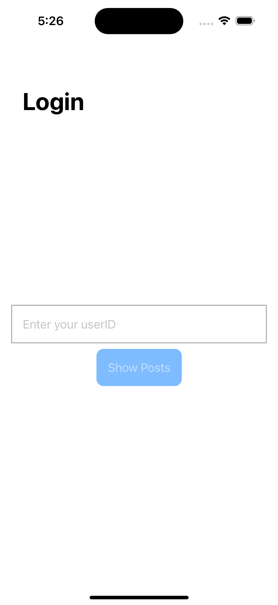
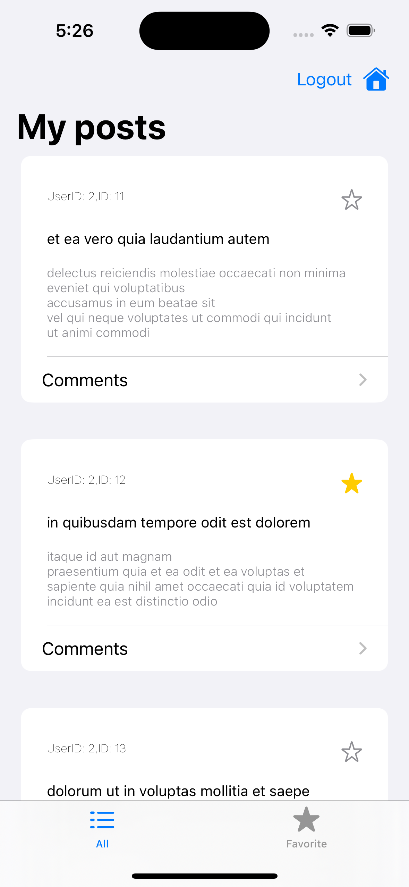
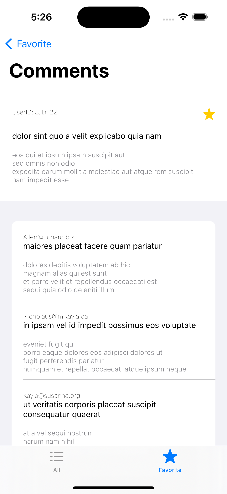
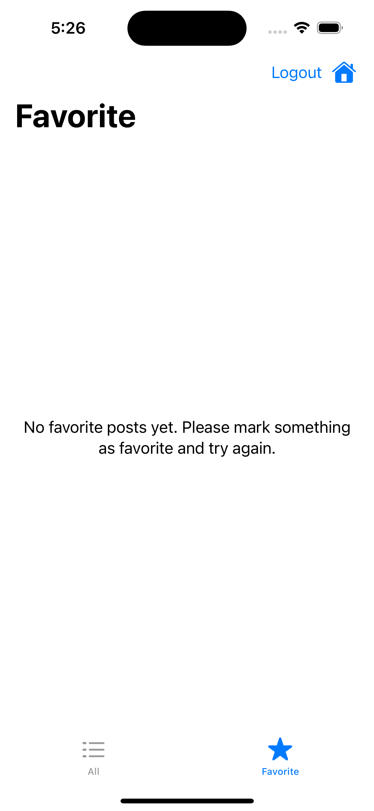

# DeutscheBankTestApp

DeutscheBankTestApp is an iOS app that allows users to log in with their UserID and fetch their posts from [JSONPlaceholder API](https://jsonplaceholder.typicode.com). Users can mark any post as a favorite, and these favorites are stored locally for later viewing. Users can easily switch between viewing all posts or only their favorite ones.

## Tech Stack
The app is developed using Swift and utilizes the following technologies and libraries:

- **SwiftUI** for building the user interface.
- **MVVM** as an architecture/
- **Alamofire** for networking tasks, fetching posts from the JSONPlaceholder API.
- **CoreData** for local persistence of favorite posts.
- **XCTest** framework for unit tests.
- **Git** for version control.

## Screenshots
- **Login screen** 

- **My posts screen** 

- **Comments screen** 

- **Error/empty state screens** 

## Features
Even if it's just the foundation of the brand new app needed to be scalable and maintainable as a standalone product, it still has a goal to provide seamless user experience. It's achieved by implementing new features not listed in requirements:

- **Basic error handling**  Our screens are designed to handle unexpected errors gracefully. The app doesn't freeze or become unresponsive due to these errors. Instead, users are promptly informed and given the next steps.

- **Loading screens**  These screens provide immediate visual feedback when content is loading or operations are being processed. This ensures a smooth user experience, even during periods of heavy processing or slow network speed.

- **UserID management**  Mistakenly entered an incorrect UserID? No worries! With our app, users can simply logout and try again without any hassle.

- **Offline usability**  Internet connection lost? Don't worry, you won't get stuck on an infinite loading page. Our app informs users about connectivity issues and allows them to continue viewing their favorite posts locally - no active internet connection needed!

## Setup
Follow these steps to get the app running on your local machine:

1. Clone this repository: `git clone https://github.com/yourusername/DeutscheBankTestApp.git`
2. Navigate to the project directory: `cd DeutscheBankTestApp`
3. Open the project in Xcode: `open DeutscheBankTestApp.xcodeproj`
4. Build and run the project in the iOS Simulator or on a physical device.

## Testing
To run the unit tests, press `Command + U` in Xcode.
